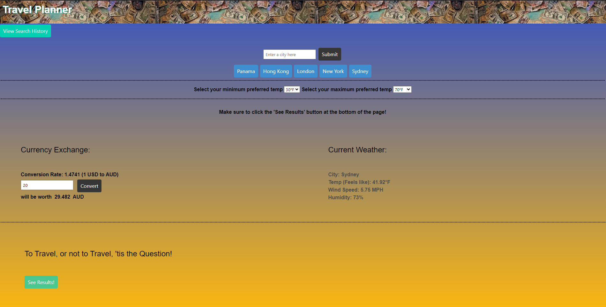

# group-proj-1

## Travel Planner Application

This application was created to help travelers consider conditions for a great travel destination. Users can enter a desired city destination, and compare the U.S Dollar to any currency in the world (with slight limiations, due to data availability).

Once a city destination is entered, the currency exchange rate for that country will be rendered on screen, along with current weather for that destination. If conditions are good, meaning the currency exchange rate is favorable (US dollar worth more than the compared currency), and weather falls within user guidelines, results will say it's a great time to travel! Otherwise, this destination might need some additional considerations.

Deployed application URL: https://efogerson1.github.io/group-proj-1/

